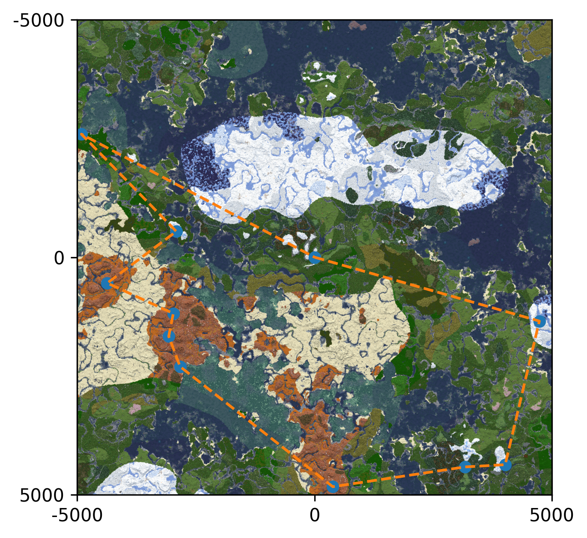

# Minecraft route finder 



```
usage: route-planner [-h] [-i INPUT] -s STRUCTURE [-d DETAILS]
                     [-o ORIGIN ORIGIN] [-l LIMIT] [--show-total-distance]
                     [--use-regex-in-details] [-w]
                     [--waypoint-dir WAYPOINT_DIR]
                     [--waypoint-colour {0,1,2,3,4,5,6,7,8,9,10,11,12,13,14,15}]
                     [--route-name ROUTE_NAME] [--waypoint-type {0,1,2,3}]
                     [--waypoint-visibility {0,1,2,3}]

Finds a route between structures in a minecraft world using the Christofides
algorithm

options:
  -h, --help            show this help message and exit
  -i INPUT, --input INPUT
                        path to the structures.csv file exported by cubiomes
                        viewer
  -s STRUCTURE, --structure STRUCTURE
                        The kind of structure we're interested in
  -d DETAILS, --details DETAILS
                        Additional details for the structure
  -o ORIGIN ORIGIN, --origin ORIGIN ORIGIN
                        the starting (x, z) position of our route, defaults to
                        (0, 0)
  -l LIMIT, --limit LIMIT
                        the number of structures to consider
  --show-total-distance
                        display the total distance of the route
  --use-regex-in-details
                        use regex matching in structure details

waypoint options:
  Xaero waypoint options

  -w, --save-waypoints  write route to xaeros minimap as a set of numbered
                        waypoints
  --waypoint-dir WAYPOINT_DIR
                        root directory of xaeros minimap waypoints for the
                        minesoc server
  --waypoint-colour {0,1,2,3,4,5,6,7,8,9,10,11,12,13,14,15}
                        waypoint colour
  --route-name ROUTE_NAME
                        route name
  --waypoint-type {0,1,2,3}
                        waypoint type specification
  --waypoint-visibility {0,1,2,3}
                        waypoint visibility specification

Written by lainon for the University of Sussex Minesoc survival server
```

## Installation 

1. `git clone https://github.com/Henry-Ash-Williams/route-finder` 
2. `cd route-finder`
3. `uv sync` 
4. If you want to use this for a different world or server, use [cubiomes-viewer](https://github.com/Cubitect/cubiomes-viewer) to export a list of structures for the world. 

## Examples 

### Find all villages 

Find a route between all villages in the seed

```
python main.py -i /path/to/structures.txt -s village
```

### Find all villages starting at 1000, 1000 

```
python main.py -i /path/to/structures.txt -s village -o 1000 1000
```

### Find all plains villages 

Find a route between all plains villages in the seed

```
python main.py -i /path/to/structures.txt -s village -d plains
```

### Limit the number of structures to consider

Find a route between 10 random villages 

```
python main.py -i /path/to/structures.txt -s village -l 10
```

### Display the total distance of the route 

Find a route between all villages and show how far the route will travel

```
python main.py -i /path/to/structures.txt -s village --show-total-distance
```

### Use regex matching in structure details 

Finds a route to end cities greater than 100 blocks in size with a ship

```
python main.py -s end_city -d "size=[1-9][0-9]{2}:ship" --use-regex-in-details
```

### Write the route to xaeros minimap 

```
python main.py -i /path/to/structures.txt -s village -d plains -w --waypoint-dir /path/to/xaero/minimap/world/
```


